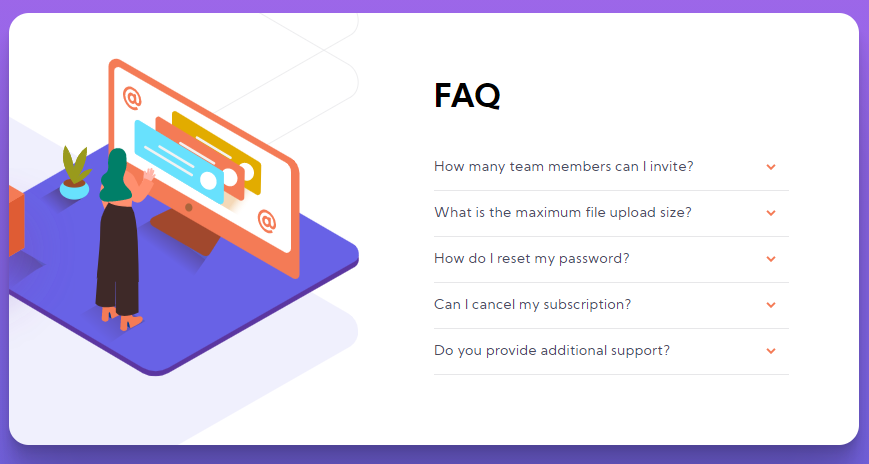
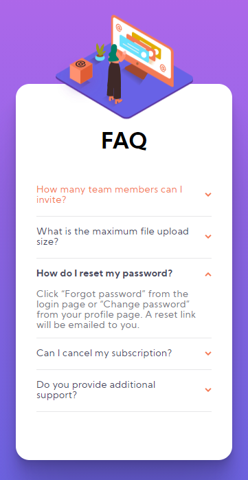

# Challenge Time #

I want to take the time to say thank you to all who took the time to visit my repository. I hope to build as many professional relationships as possible as well as creating opportunities to learn and grow as a developer.

---

### FAQ Accordion Component:

 

#### Challenge Description:

##### Overview: 

This challenge was provided by [Frontend Mentor](https://www.frontendmentor.io/). The provided solution is my attempt to re-build the defined layout in order to increase my html, css, and javascript capabilities.

##### Requirements: Your users should be able to:

- View the optimal layout for the component depending on their device's screen size
- See hover states for all interactive elements on the page
- Hide/Show the answer to a question when the question is clicked

Your task is to build out the project to the designs inside the `/design` folder. You will find both a mobile and a desktop version of the design to work to.

The designs are in JPG static format. This will mean that you'll need to use your best judgment for styles such as `font-size`, `padding` and `margin`. This should help train your eye to perceive differences in spacings and sizes.

##### Solution is Deployed on Vercel at the below site:

[Live Preview of Solution](https://faq-accordion.thebizzydev.vercel.app/)

